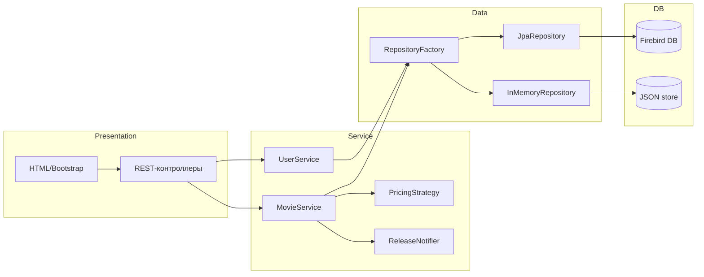

# 🎬 CinemaHome – Онлайн/офлайн кинотеатр  

## 1️⃣ Общее описание  

**CinemaHome** – это простое веб‑приложение, которое позволяет просматривать каталог фильмов, искать их по названию/актеру/жанру, а также «смотреть» фильмы как онлайн‑стрим (ссылка на файл) и как офлайн‑копию (скачать).

* Приложение развёртывается в **localhost** (порт `8080`).  
* Данные о фильмах, жанрах, актёрах хранятся в **Firebird**. Если Firebird не установлен, приложение автоматически переключается на **JSON‑файл** (`data/store.json`).  
* Всё написано на **Java 17**, управляется сборщиком **Gradle**, использует **Spring Boot 3.1**.  

---  

## 2️⃣ Технологический стек  

| Категория | Технология | Зачем |
|-----------|------------|------|
| **Язык** | Java 17 | Современный LTS, поддержка Record, sealed‑классов |
| **Сборка** | Gradle (plugins: `org.springframework.boot`, `io.spring.dependency-management`) | Автоматическое управление зависимостями |
| **Web‑фреймворк** | Spring Boot 3.1 | Встроенный Tomcat, автоконфигурация |
| **REST** | Spring Web MVC | Контроллеры, JSON‑ответы |
| **База данных** | Firebird 3 (JDBC‑драйвер Jaybird 3.0.10) + Flyway | Надёжное реляционное хранилище |
| **Fallback‑Хранилище** | JSON (Jackson) | Позволяет работать без установленного Firebird |
| **JPA** | Spring Data JPA + Hibernate | DAO‑слой, репозитории |
| **Безопасность** | Spring Security (basic auth) | Авторизация пользователей |
| **Тесты** | JUnit 5, Mockito, Spring Boot Test | Юнит‑ и интеграционные тесты |
| **Утилиты** | Lombok (optional) | Сокращение шаблонного кода |
| **Frontend** | HTML5 + CSS (Bootstrap 5) | Публичный UI (`src/main/resources/static/index.html`) |
| **CI** | GitHub Actions (optional) | Автоматический билд/тесты |

---  

## 3️⃣ Функциональные возможности  

| № | Функция | Описание |
|---|---------|----------|
| 1 | Регистрация/аутентификация | Пользователь может создать аккаунт, войти, выйти (Spring Security). |
| 2 | Просмотр каталога | Список всех фильмов с постером, годом выпуска, жанрами. |
| 3 | Поиск/фильтрация | По названию, году, жанру, имени актёра. |
| 4 | Детальная страница фильма | Описание, список актёров, ролей, жанры, кнопки **Play** (онлайн) и **Download** (офлайн). |
| 5 | Управление контентом (admin) | CRUD‑операции над фильмами, жанрами, актёрами. |
| 6 | Ценообразование (Strategy) | Разные стратегии ценообразования: обычная, со скидкой, премиум. |
| 7 | Уведомления о новых релизах (Observer) | При добавлении нового фильма пользователи могут получать email‑уведомление (имитация). |
| 8 | Фабрика репозиториев (Factory) | В зависимости от наличия Firebird создаётся `JpaRepository` или `InMemoryRepository` (JSON). |
| 9 | API‑документация | OpenAPI (Swagger) доступен по адресу `/swagger-ui.html`. |

---  

## 4️⃣ Архитектура проекта  

* **Controller** – слой презентации, принимает HTTP‑запросы, возвращает DTO.  
* **Service** – бизнес‑логика, использует стратегии и наблюдателей.  
* **Repository** – абстракция доступа к данным, реализована двумя способами (JPA + JSON).  
* **Config** – Spring‑конфиги (WebSecurity, DataSource).  

---  

## 5️⃣ Паттерны, интерфейсы и их реализации  

| Паттерн | Интерфейс | Реализации (по 3) |
|--------|-----------|-------------------|
| **Factory** | `RepositoryFactory` (интерфейс) | `JpaRepositoryFactory` (создаёт JPA‑репозитории), `JsonRepositoryFactory` (создаёт репозитории‑обёртки над JSON), `MockRepositoryFactory` (для тестов) |
| **Strategy** | `PricingStrategy` | `BasePricingStrategy` (базовая цена), `DiscountPricingStrategy` (скидка %), `PremiumPricingStrategy` (повышенная цена для новых релизов) |
| **Observer** | `ReleaseNotifier` | `EmailNotifier` (отправка письма), `SmsNotifier` (заглушка для SMS), `InAppNotifier` (внутри приложения – хранит события в памяти) |

---  

## 6️⃣ Подготовка окружения  

### 6.1 Требования  

| Требование | Версия/описание |
|-----------|-----------------|
| Java | JDK 21 (или выше) |
| Gradle | 8.x (wrapper уже включён) |
| Firebird | 3.0+ (опционально) |
| Git | Любой |
| (Опционально) Docker | Для развёртывания Firebird в контейнере |

